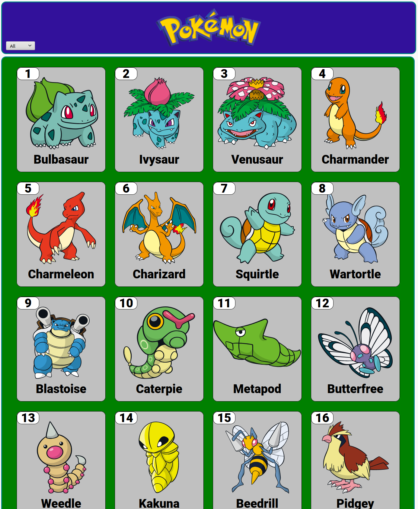
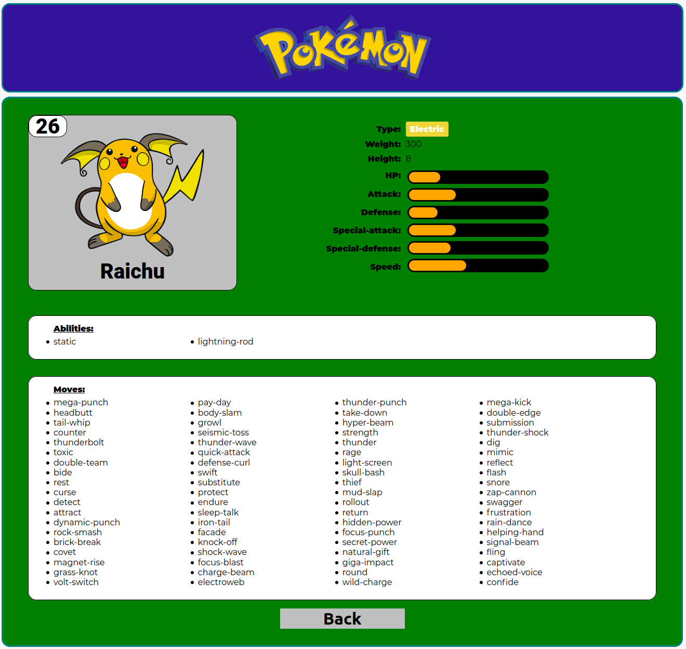
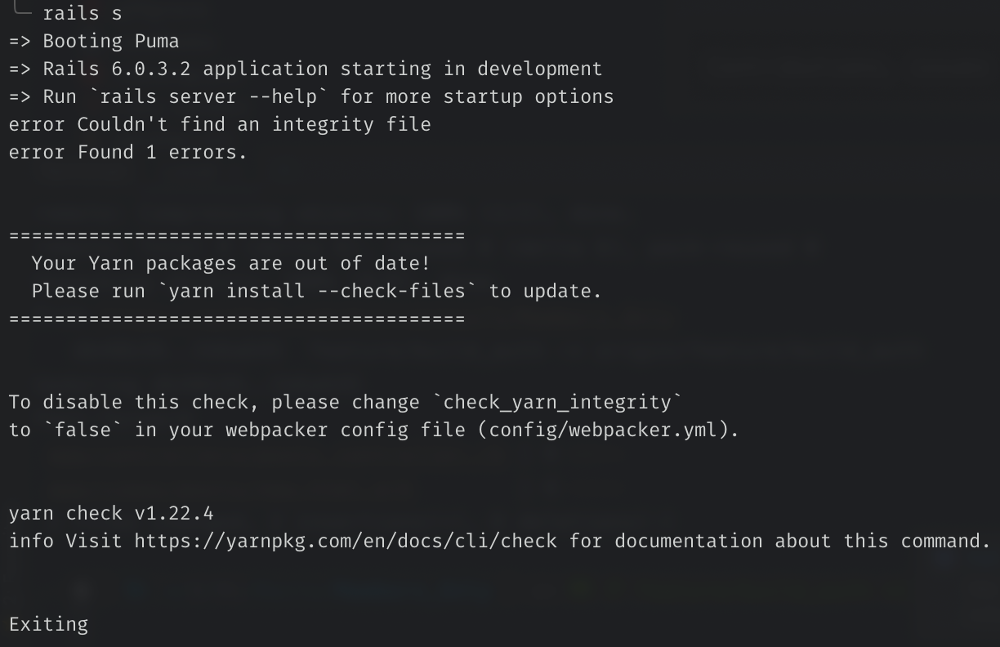

# Pokemon API

This API is to improve the operation of the Pokedex project. Send the necessary elements and data according to the operation.





## :package: Built With

- HTML and JSX
- CSS
- Javascript (ES6)
- React
- Redux
- Ruby
- Ruby on Rails
- Postgres
- REST API
- npm

## :mag: Live Demo

[Live Demo Link](https://pokemons-api-project.herokuapp.com)

## :computer: Getting Started

To get a local copy up and running follow these simple steps.

### Download

1) Clone the repository to your local machine

```sh
  $ git clone https://github.com/mcervantes71/Pokemon_API.git
```

2) cd into the directory

```sh
  $ cd Pokemon_API
```

### Setup

Install gems with:

```sh
  $ bundle install
```

Install all dependencies:

```sh
  $ yarn install
```

Setup database with:

```sh
  $ rails db:create
  $ rails db:migrate
```

Populating the database with:

```sh
  $ rails db:seed
```

### Usage

run localhost server:

```sh
  $ rails server
```

if presented with and `Error` message similar to this:



Run:

```sh
  $ yarn install --check-files
```

### API Documentation

| Verb   | URI                          |
| ------ |:----------------------------:|
| GET    | /pokemons/:id(.:format)      |
| GET    | /pokemon_info/:id(.:format)  |

## :busts_in_silhouette: Author

👤 **Martin Cervantes**

- Linkedin: [Martin Cervantes](https://www.linkedin.com/in/cervantesmartin/)
- Twitter: [@M4rt1nC3rv4nt3s](https://twitter.com/M4rt1nC3rv4nt3s)
- Github: [@mcervantes71](https://github.com/mcervantes71)
- Gmail: [cervantes.martine](mailto:cervantes.martine@gmail.com)

:pencil2: Design idea by [Nelson Sakwa on Behance](https://www.behance.net/sakwadesignstudio)

## 🤝 Contributing

Contributions, issues and feature requests are welcome!

Feel free to check the [issues page](../../issues).

## :star2: Show your support

Give a ⭐️ if you like this project!

## 📝 License

This project is [MIT](lic.url) licensed.
